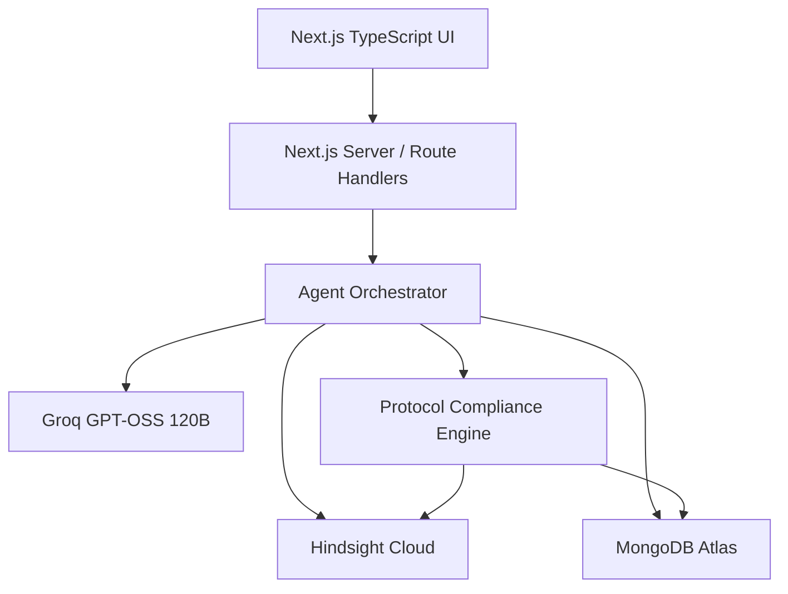
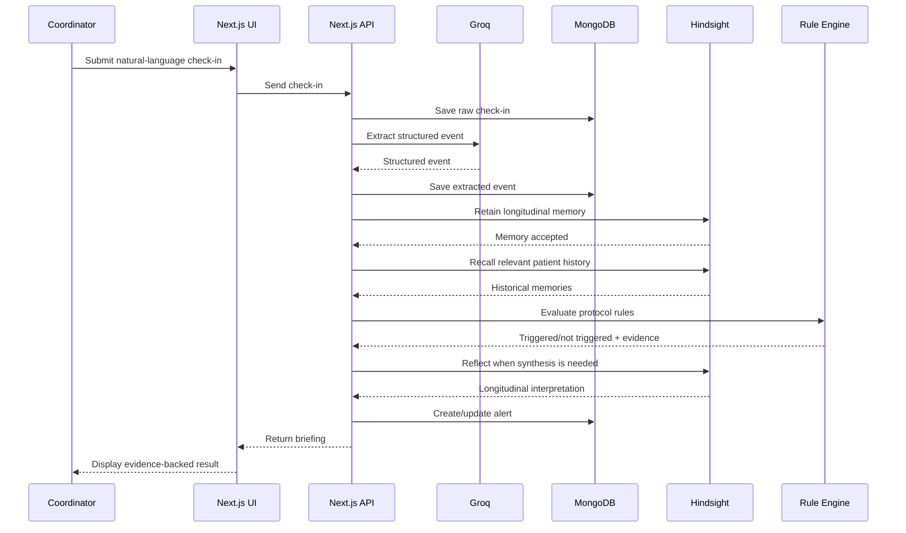
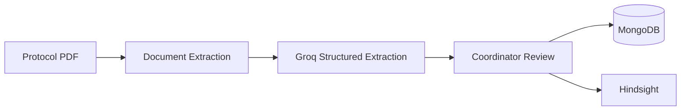

# Product Requirements Document (PRD)
# Clinical Trial & Patient Protocol Compliance Agent

**Document status:** Implementation-ready  
**Version:** 1.0  
**Date:** 2026-09-29  
**Project type:** Hindsight Hackathon / AI Agent Prototype  
**Primary user:** Clinical Research Coordinator  
**Secondary users:** Trial Operations Lead, Study Manager, Demo/Judge  
**Primary objective:** Demonstrate a production-style, memory-powered clinical trial operations copilot in which Hindsight memory is central to longitudinal patient insight and protocol-compliance workflows.

---

## 1. Document Control

| Field | Specification |
|---|---|
| Product | Clinical Trial & Patient Protocol Compliance Agent |
| Working description | Memory-powered clinical trial operations copilot |
| Frontend | Next.js + TypeScript/TSX |
| Backend | Next.js App Router / Route Handlers |
| Database | MongoDB Atlas |
| Long-term memory | Hindsight Cloud |
| LLM | Groq |
| Primary model | `openai/gpt-oss-120b` |
| Agent orchestration | Vercel AI SDK and/or direct Groq tool-calling orchestration |
| Validation | Zod + JSON Schema |
| Charts | Recharts |
| UI styling | Tailwind CSS |
| Animation | Framer Motion |
| Deployment | Vercel |
| Source control | GitHub |
| Data | Synthetic clinical-trial data only |
| Required platform | Hindsight |
| Production safety posture | Prototype / decision-support workflow; not diagnosis or treatment |

---

# 2. Executive Summary

Clinical research trials generate large volumes of fragmented patient information over weeks and months. Patient check-ins may contain symptoms, missed doses, delayed doses, side effects, adherence notes, and contextual details written in natural language. Traditional systems often preserve these as isolated records, forcing coordinators to manually reconstruct the longitudinal story.

The proposed product is a **memory-powered clinical trial operations copilot** that continuously builds a longitudinal understanding of each synthetic trial participant. It ingests natural-language check-ins, stores structured operational data in MongoDB, retains meaningful longitudinal memories in Hindsight, retrieves historical evidence, evaluates deterministic protocol rules, and generates coordinator briefings that highlight potential compliance issues and recurring patterns.

The uploaded project blueprint explicitly defines the core concept as an autonomous, memory-powered clinical operations co-pilot using Hindsight persistent memory and learning to track a patient's longitudinal journey, analyze unstructured logs against trial protocols, and surface actionable compliance insights. fileciteturn0file0L3-L6

The product is intentionally **not a diagnostic medical system**. It does not diagnose diseases, prescribe treatment, or alter medication. It is a synthetic-data hackathon prototype for clinical-trial operations and protocol/adherence monitoring.

The central product proposition is:

> **A check-in is no longer an isolated record. Hindsight turns the patient's history into continuously retrievable context, allowing the agent to identify longitudinal patterns that a stateless workflow would miss.**

---

# 3. Problem Statement

## 3.1 Core problem

Clinical research coordinators managing multi-month trials face visibility gaps because patient information is fragmented across repeated check-ins, forms, notes, and operational systems.

The original project specification states the problem as a reliance on fragmented, stateless patient-reporting systems that treat each check-in as an isolated event, making it difficult to identify cumulative adverse trends, behavioral non-adherence patterns, and protocol deviations across months. fileciteturn0file0L10-L11

## 3.2 Operational impact

The product is designed to address these visibility gaps:

- Cumulative adherence issues may be difficult to notice.
- Repeated symptoms may be disconnected from earlier reports.
- Natural-language patient reports contain information that rigid forms can lose.
- Coordinators spend time reviewing historical records manually.
- Potential protocol deviations may be noticed later than ideal.
- Coordinator decisions and corrections are not automatically transformed into reusable context.

## 3.3 Current software gap

The source blueprint identifies three major limitations:

1. **Static form collection** — rigid checkboxes do not capture rich human-language context well.
2. **Weak longitudinal synthesis** — individual systems may store today's symptom without automatically linking it to similar historical events.
3. **Limited autonomous reasoning** — systems may store events without proactively checking cumulative patterns against complex trial rules. fileciteturn0file0L26-L34

The proposed product addresses these gaps while remaining narrow enough for a hackathon prototype.

---

# 4. Product Vision

## 4.1 Vision statement

Build a clinical-trial operations assistant that acts as an **evolving memory layer** for synthetic trial participants.

The assistant should:

- Understand natural-language check-ins.
- Remember longitudinal events through Hindsight.
- Retrieve relevant historical evidence.
- Detect recurring behavioral/adherence patterns.
- Compare structured evidence against approved trial protocol rules.
- Explain why an alert was generated.
- Keep a human coordinator in control.
- Learn from verified coordinator decisions.

## 4.2 Core product principle

**MongoDB stores the operational truth. Hindsight stores and reasons over longitudinal context.**

MongoDB answers:

> “What records exist?”

Hindsight answers:

> “What has this patient repeatedly experienced, what patterns have emerged, and what historical context is relevant now?”

This separation is a core architectural requirement.

---

# 5. Goals

## 5.1 Primary goals

1. Demonstrate that Hindsight is central to product value.
2. Show clear improvement across repeated patient interactions.
3. Ingest natural-language patient reports.
4. Transform unstructured reports into structured trial events.
5. Maintain patient-isolated longitudinal memory banks.
6. Evaluate adherence and protocol rules deterministically.
7. Generate evidence-backed coordinator alerts.
8. Support natural-language coordinator queries.
9. Capture coordinator verification and feed it back into memory.
10. Deliver a polished, realistic end-to-end demo.

## 5.2 Secondary goals

- Provide protocol PDF ingestion.
- Provide a patient longitudinal timeline.
- Expose Hindsight-derived observations and mental models.
- Provide a "Without Memory vs With Hindsight" comparison.
- Provide an understandable technical architecture for judges.
- Provide a clean GitHub repository and reproducible setup.

---

# 6. Non-Goals

The MVP must not attempt to become a full clinical research platform.

The following are out of scope:

- Real patient data.
- Clinical diagnosis.
- Treatment recommendations.
- Medication changes.
- Electronic medical record replacement.
- Billing.
- Hospital management.
- Telemedicine.
- Full patient mobile application.
- Full regulatory-compliance certification.
- Production clinical deployment.
- Large-scale multi-tenant enterprise identity infrastructure.
- Complex hospital integration.
- General-purpose chatbot functionality unrelated to trial operations.

The product is a hackathon prototype using synthetic data.

---

# 7. Target Users and Personas

## 7.1 Primary Persona — Clinical Research Coordinator

### Needs

- Quickly understand patient adherence history.
- Identify potential protocol deviations.
- Search patient history using natural language.
- See evidence behind alerts.
- Verify or dismiss AI-generated alerts.
- Reduce manual historical review.

### Example questions

- “Has this patient missed doses before?”
- “Which patients have repeated late doses this month?”
- “Why was P1047 flagged?”
- “Has the fatigue report happened previously?”
- “What changed in this patient's adherence pattern?”

---

## 7.2 Secondary Persona — Trial Operations Lead

### Needs

- High-level trial visibility.
- Outstanding alerts.
- Patient compliance trends.
- Repeated patterns across patients.
- Review workload visibility.

---

## 7.3 Secondary Persona — Hackathon Judge

### Needs

- Immediately understand the problem.
- Clearly see Hindsight usage.
- See a compelling learning curve.
- Understand why the architecture is differentiated.
- See polished UX and realistic data.

---

# 8. User Journey

## 8.1 Protocol onboarding

1. Coordinator creates/selects a trial.
2. Coordinator uploads a synthetic trial protocol PDF.
3. System extracts protocol text/rules.
4. Groq converts relevant requirements into structured rules.
5. Coordinator reviews and approves extracted rules.
6. Approved rules become the deterministic compliance source of truth.
7. Relevant protocol context is also stored in Hindsight for contextual reasoning.

---

## 8.2 Patient check-in

1. Coordinator or synthetic patient input submits a natural-language check-in.
2. System stores original text in MongoDB.
3. Groq extracts structured event fields.
4. System retains meaningful longitudinal information in the patient's Hindsight memory bank.
5. System retrieves relevant patient history from Hindsight.
6. Deterministic protocol engine evaluates current and historical structured events.
7. If needed, Hindsight Reflect synthesizes historical context.
8. System creates/updates an alert.
9. Coordinator reviews the result.

---

## 8.3 Coordinator verification

1. Coordinator opens alert.
2. System displays current event, historical evidence, applicable rule, and explanation.
3. Coordinator chooses Confirm, Dismiss, or Needs Review.
4. Decision is stored in MongoDB.
5. Decision is retained in Hindsight as verified context.
6. Future reasoning can use this previous decision.

---

# 9. Product Experience

## 9.1 Core user experience principle

The UI should feel like a **clinical operations command center**, not a generic chatbot.

Recommended visual direction:

- Professional clinical SaaS aesthetic.
- Dark navy/white base.
- Muted medical-blue accents.
- Green for healthy/positive states.
- Orange/red only for alerts.
- High information density without visual clutter.
- Subtle animation only where it improves comprehension.

---

# 10. Functional Requirements

## FR-001 — Trial management

The system shall support:

- Trial creation.
- Trial metadata.
- Protocol version.
- Trial status.
- Synthetic patient association.

### Acceptance criteria

A coordinator can open a trial and see its protocol version, patient count, and active alerts.

---

## FR-002 — Protocol upload

The system shall support uploading a synthetic protocol PDF.

The workflow shall:

1. Receive the file.
2. Extract text/content.
3. Identify protocol-relevant requirements.
4. Produce structured protocol rules.
5. Preserve source-page/reference information where possible.
6. Allow coordinator approval/edit/rejection.

Hindsight currently supports asynchronous file ingestion for PDFs and other files, converting files to markdown and creating memories from the extracted content. citeturn503321search6

### Acceptance criteria

A coordinator can upload a protocol and review extracted rules before they can trigger compliance alerts.

---

## FR-003 — Patient management

The system shall support synthetic patients with:

- Patient ID.
- Trial ID.
- Enrollment date.
- Treatment group.
- Status.
- Synthetic display name.
- Hindsight bank ID.

---

## FR-004 — Natural-language check-ins

The system shall accept natural-language check-ins such as:

> “I felt a bit dizzy on Thursday morning and took my capsule two hours late.”

The original text shall be preserved.

---

## FR-005 — Structured event extraction

The system shall transform text into structured information such as:

- Event date.
- Symptom.
- Symptom severity.
- Medication adherence state.
- Delay/missed-dose information.
- Reported side effects.
- Notes.
- Source type.

Structured extraction shall use schema validation.

Groq currently supports Structured Outputs with JSON Schema and lists `openai/gpt-oss-120b` as a supported strict-mode model. citeturn160680search1

---

## FR-006 — Longitudinal memory

Every meaningful patient event shall be retained in the patient's Hindsight bank.

Recommended bank convention:

`trial_<trialId>_patient_<patientId>`

Hindsight's current guidance recommends separate memory banks for different users/projects/agents and emphasizes meaningful bank names and temporal references. citeturn503321search5

---

## FR-007 — Memory recall

The system shall support patient-specific historical retrieval for:

- Symptoms.
- Adherence events.
- Late/missed doses.
- Previous alerts.
- Coordinator decisions.
- Historical patterns.

Hindsight Recall currently supports retrieving relevant memories and filtering by memory type such as world, experience, and observation. citeturn503321search2

---

## FR-008 — Memory reflection

The system shall use Hindsight Reflect for questions that require longitudinal synthesis.

Examples:

- “What adherence pattern is emerging?”
- “What should the coordinator know about this patient's recent history?”
- “Is the current event similar to previous reports?”

Hindsight Reflect currently synthesizes experience, world facts, observations, and mental models and can return supporting source memories. citeturn503321search1turn503321search7

---

## FR-009 — Observations

The application shall expose higher-level memory insights where useful.

Examples:

- “Repeated Tuesday fatigue reported over three consecutive weeks.”
- “Late-dose events increased during the last reporting period.”

These must be presented as system-derived observations, not medical diagnoses.

---

## FR-010 — Mental models

The system shall maintain useful pre-computed views for frequently queried information.

Recommended mental models:

1. Patient adherence profile.
2. Patient symptom pattern.
3. Patient protocol-compliance history.

Hindsight currently supports creating mental models as pre-computed reflections that stay current as memories change. citeturn503321search4turn503321search5

---

## FR-011 — Deterministic protocol compliance

The system shall evaluate rules using structured data and deterministic logic.

The LLM shall not be the final authority for numeric thresholds, date windows, or counts.

Examples:

- Missed doses in a seven-day window.
- Late-dose count.
- Missing check-in duration.
- Repeated symptom threshold.
- Rule severity.

---

## FR-012 — Alert generation

The system shall generate alerts containing:

- Alert type.
- Severity.
- Patient.
- Current event.
- Historical evidence.
- Triggered protocol rule.
- Explanation.
- Status.
- Created timestamp.

Alert types may include:

- `MISSED_DOSE`
- `LATE_DOSE_PATTERN`
- `RECURRING_SYMPTOM`
- `POTENTIAL_PROTOCOL_DEVIATION`
- `MISSING_CHECKIN`
- `INCONSISTENT_REPORT`

---

## FR-013 — Human-in-the-loop review

Every material alert shall support:

- Confirm.
- Dismiss.
- Needs review.

The coordinator decision shall be persisted and retained into Hindsight.

---

## FR-014 — Conversational coordinator assistant

The assistant shall support queries across patient and trial context.

Examples:

> “Show patients who missed more than two doses and reported fatigue this month.”

> “Why was P1047 flagged?”

> “What changed in P1047's adherence over the last 30 days?”

---

## FR-015 — Evidence transparency

Every AI-derived alert or briefing shall expose supporting evidence.

Minimum evidence:

- Date.
- Event.
- Source.
- Relevant protocol rule.
- Hindsight memory/observation reference where available.

---

## FR-016 — Without-Memory vs With-Hindsight demonstration

The product shall include a dedicated comparison experience.

### Without memory

Use only current input plus applicable current protocol context.

### With Hindsight

Use current input plus historical memories, observations, mental models, and coordinator feedback.

The source blueprint explicitly recommends a side-by-side "Without Memory vs With Hindsight Memory" experience. fileciteturn0file0L55-L58

---

# 11. Memory Architecture

## 11.1 Core rule

Hindsight is not a replacement for MongoDB.

### MongoDB stores

- Trials.
- Patients.
- Check-ins.
- Protocol rules.
- Alerts.
- Coordinator reviews.
- Agent audit events.

### Hindsight stores/reasons over

- Longitudinal patient experiences.
- Contextual facts.
- Historical patterns.
- Observations.
- Coordinator feedback.
- Higher-level mental models.

---

## 11.2 Memory bank isolation

Each patient gets an isolated bank:

`trial_<trialId>_patient_<patientId>`

This prevents accidental cross-patient context.

### Requirement

No patient query may recall another patient's private memory bank.

---

## 11.3 Retain strategy

Retain the following:

### Patient events

- Symptom reports.
- Medication timing/adherence.
- Important check-in context.
- Relevant patient statements.

### Operational context

- Coordinator verification.
- Alert outcomes.
- Protocol interpretation decisions.

### Temporal information

Every memory should include a meaningful event timestamp when known.

Hindsight recommends specific, concrete memories with relevant context and temporal references because dates and times enable temporal retrieval. citeturn503321search5

---

## 11.4 Tagging strategy

Recommended tags:

- `trial:<trialId>`
- `patient:<patientId>`
- `source:checkin`
- `source:coordinator`
- `event:symptom`
- `event:medication`
- `adherence:late`
- `adherence:missed`
- `severity:mild|moderate|high`

---

## 11.5 Hindsight bank mission

Recommended mission:

> Focus on trial adherence, medication timing, reported symptoms, adverse-event reports, protocol deviations, recurring patterns, unresolved compliance issues, and coordinator verification. Ignore irrelevant conversational content. Do not infer diagnoses or treatment recommendations.

---

## 11.6 Hindsight directives

Recommended directives:

1. Never diagnose a medical condition.
2. Never recommend treatment or medication changes.
3. Identify protocol/adherence concerns only when supported by stored evidence or approved protocol rules.
4. Include dates when citing historical evidence.
5. Clearly distinguish observed facts from inferred patterns.
6. Require coordinator review before official compliance status changes.

---

## 11.7 Mental models

### Model A — Adherence Profile

Source query:

> “What are this patient's recurring adherence patterns, late doses, missed doses, and improvements?”

### Model B — Symptom Pattern

Source query:

> “What recurring symptoms have been reported, when do they occur, and what historical patterns are supported by evidence?”

### Model C — Protocol Compliance History

Source query:

> “What potential or confirmed protocol deviations have occurred, and how did coordinators resolve them?”

---

# 12. Technical Architecture

## 12.1 High-level architecture



---

## 12.2 Responsibility boundaries

### Next.js

Responsible for:

- User interface.
- Route handlers.
- Authentication/session boundary if added.
- Request validation.
- Application orchestration.
- Streaming agent responses if desired.

### Groq

Responsible for:

- Natural-language understanding.
- Structured event extraction.
- Protocol-rule extraction.
- Agent tool selection.
- Response generation.

Groq currently documents `openai/gpt-oss-120b` with tool use, JSON Object Mode, JSON Schema Mode, reasoning, and a 131,072-token context window. citeturn160680search0

### Hindsight

Responsible for:

- Long-term memory.
- Recall.
- Longitudinal synthesis.
- Observations.
- Mental models.
- Evidence-backed historical context.

### MongoDB

Responsible for:

- Structured system-of-record data.
- Queryable operational state.
- Alert status.
- Coordinator decisions.
- Protocol rules.

### Compliance Engine

Responsible for:

- Threshold evaluation.
- Date-window logic.
- Count logic.
- Deterministic rule evaluation.
- Protocol status calculations.

---

# 13. Recommended Technology Stack

| Layer | Technology | Rationale |
|---|---|---|
| UI | Next.js + TypeScript/TSX | Strong fit for the team's React/Next.js experience |
| Styling | Tailwind CSS | Fast, consistent UI development |
| Charts | Recharts | Patient timeline, adherence, trends |
| Animation | Framer Motion | Polished but restrained interactions |
| Server | Next.js Route Handlers | Avoids unnecessary separate backend for MVP |
| Database | MongoDB Atlas | Simple structured operational state |
| ODM | Mongoose | Schema and query support |
| Memory | Hindsight Cloud | Mandatory hackathon technology; core differentiator |
| Memory SDK | `@vectorize-io/hindsight-client` | Official TypeScript SDK |
| AI orchestration | Vercel AI SDK and/or custom agent loop | TypeScript-friendly tool orchestration |
| LLM | Groq | Fast inference and agent/tool support |
| Primary model | `openai/gpt-oss-120b` | Tool use + JSON Schema + reasoning |
| Validation | Zod | Runtime validation |
| Deployment | Vercel | Natural fit for Next.js |
| Source control | GitHub | Required submission artifact |

The Hindsight TypeScript SDK currently supports creating banks, Retain, Recall, Reflect, and mental models. citeturn503321search3

---

# 14. Why GPT-OSS 120B

The recommended primary model is:

`openai/gpt-oss-120b`

Current Groq documentation lists:

- Tool use.
- JSON Object Mode.
- JSON Schema Mode.
- Reasoning.
- 131,072-token context window.

citeturn160680search0

Use it for:

1. Natural-language extraction.
2. Protocol rule extraction.
3. Agent tool selection.
4. Coordinator assistant responses.
5. Longitudinal synthesis when appropriate.

---

# 15. Structured Output Strategy

For extraction tasks:

- Define schemas first.
- Use strict JSON Schema output where supported.
- Validate again server-side with Zod.
- Reject malformed results.
- Never persist unchecked LLM output as trusted structured data.

Groq's current Structured Outputs documentation states that strict mode guarantees schema-conformant output for supported models and includes `openai/gpt-oss-120b`. citeturn160680search1

---

# 16. Tool-Calling Strategy

The coordinator assistant should have bounded tools.

Recommended tools:

1. `get_patient`
2. `search_patients`
3. `get_patient_timeline`
4. `recall_patient_memory`
5. `reflect_patient_memory`
6. `get_protocol_rules`
7. `evaluate_protocol_compliance`
8. `get_alert_history`
9. `get_coordinator_reviews`
10. `record_coordinator_review`

The application, not the model, executes each tool.

Groq's current local tool-calling documentation describes the application responsibility for executing tools and recommends a bounded agentic loop that ends when no further tool calls are requested or a maximum iteration count is reached. citeturn160680search3

---

# 17. Agent Safety and Tool Error Handling

The agent must handle:

- Invalid tool name.
- Invalid tool arguments.
- Malformed JSON.
- Missing required parameters.
- Tool timeout.
- Hindsight unavailable.
- Groq unavailable.
- MongoDB unavailable.
- Empty memory results.
- Conflicting historical evidence.

Groq documents specific tool-call validation failures and a `failed_generation` error payload for invalid tool calls. citeturn160680search3

### Required recovery design

1. Validate tool-call schema.
2. Reject invalid calls.
3. Retry only within a strict limit.
4. Record failed attempts for observability.
5. Stop after a bounded number of iterations.
6. Return a safe fallback response.

---

# 18. Data Model

## 18.1 Trial

| Field | Purpose |
|---|---|
| `trialId` | Stable identifier |
| `name` | Trial display name |
| `protocolVersion` | Active protocol version |
| `sponsor` | Synthetic sponsor |
| `startDate` | Trial start |
| `endDate` | Trial end |
| `status` | Draft/Active/Completed |

---

## 18.2 Patient

| Field | Purpose |
|---|---|
| `patientId` | Synthetic identifier |
| `trialId` | Trial association |
| `displayName` | Synthetic display name |
| `enrollmentDate` | Enrollment |
| `treatmentGroup` | Synthetic treatment group |
| `status` | Active/Withdrawn/Completed |
| `hindsightBankId` | Patient-specific Hindsight bank |

---

## 18.3 CheckIn

| Field | Purpose |
|---|---|
| `checkInId` | Unique event |
| `patientId` | Patient |
| `trialId` | Trial |
| `submittedAt` | Submission timestamp |
| `eventDate` | Reported event date |
| `rawText` | Original natural-language report |
| `structuredSymptoms` | Extracted symptoms |
| `doseStatus` | On-time/Late/Missed |
| `doseDelayMinutes` | Delay duration |
| `source` | Patient/Coordinator |
| `processingStatus` | Pending/Processed/Failed |

---

## 18.4 Protocol Rule

| Field | Purpose |
|---|---|
| `ruleId` | Rule identifier |
| `trialId` | Trial |
| `title` | Human-readable rule |
| `condition` | Rule condition |
| `threshold` | Numeric threshold if applicable |
| `timeWindow` | Relevant period |
| `requiredAction` | Coordinator workflow |
| `severity` | Severity |
| `sourcePage` | Protocol source |
| `approved` | Coordinator approval |
| `version` | Protocol version |

---

## 18.5 Alert

| Field | Purpose |
|---|---|
| `alertId` | Unique alert |
| `patientId` | Patient |
| `trialId` | Trial |
| `type` | Alert category |
| `severity` | Severity |
| `reason` | Explanation |
| `currentEventId` | Trigger event |
| `historicalEvidence` | Relevant events |
| `ruleId` | Triggered protocol rule |
| `status` | Open/Confirmed/Dismissed |
| `createdAt` | Timestamp |
| `reviewedAt` | Review timestamp |

---

## 18.6 Coordinator Review

| Field | Purpose |
|---|---|
| `reviewId` | Review ID |
| `alertId` | Alert |
| `decision` | Confirmed/Dismissed/Needs Review |
| `reason` | Human explanation |
| `reviewer` | Synthetic/current user |
| `timestamp` | Review time |

---

# 19. Protocol Rule Engine

## 19.1 Purpose

Separate deterministic compliance logic from generative AI.

## 19.2 Responsibilities

The engine must:

- Count events.
- Evaluate thresholds.
- Evaluate date windows.
- Detect missing check-ins.
- Determine whether approved rules are triggered.
- Return machine-readable results.
- Provide evidence references.

## 19.3 Example synthetic rule

**Rule R-02**

> More than two missed doses within seven days requires coordinator review.

The engine must calculate:

- Number of missed doses in the specified window.
- Whether the threshold is exceeded.
- Which events contributed.

The LLM may explain the result, but must not independently invent or calculate the official rule.

---

# 20. End-to-End Check-In Pipeline



---

# 21. Protocol Ingestion Pipeline



Hindsight currently supports file-to-memory ingestion for PDFs, DOCX, PPTX, XLSX, images, and audio through its file-retain capability; for this product, the primary use case is synthetic protocol PDFs and the application's own structured rule-review workflow. citeturn503321search6

---

# 22. Memory Processing Pipeline

## Event memory

Natural-language check-in  
→ Extract relevant event  
→ Retain in patient bank  
→ Hindsight extracts memories/observations  
→ Recall for future relevant queries

Hindsight's Retain operation currently processes natural-language content, extracts structured memories, categorizes information, and indexes it for retrieval. citeturn503321search0

---

# 23. Recall vs Reflect

## Use Recall when

- The system needs exact historical evidence.
- The coordinator asks “what happened?”
- The UI needs historical events.
- Evidence cards must be populated.

## Use Reflect when

- The system needs longitudinal synthesis.
- The coordinator asks “what pattern is emerging?”
- Multiple observations need to be synthesized.
- The system needs a contextual briefing.

Hindsight currently distinguishes Recall from Reflect in this way: Recall returns relevant memories, while Reflect synthesizes information from memories and higher-level context. citeturn503321search2turn503321search7

---

# 24. User Interface Requirements

## 24.1 Dashboard

Top-level components:

### KPI cards

- Active Patients.
- Patients Needing Review.
- Potential Deviations.
- Unresolved Alerts.

### Patient compliance table

Columns:

- Patient.
- Adherence.
- Latest Check-in.
- Open Alerts.
- Trend.
- Memory Status.

### Recent alerts

Show highest-priority open items.

### Patterns discovered

Show Hindsight-derived observations.

---

## 24.2 Patient detail

Sections:

1. Overview.
2. Adherence chart.
3. Symptom timeline.
4. Protocol events.
5. Alerts.
6. Hindsight memory.
7. Coordinator notes.

---

## 24.3 Patient timeline

The timeline should visualize:

- Enrollment.
- Check-ins.
- Late doses.
- Missed doses.
- Symptoms.
- Potential deviations.
- Coordinator reviews.
- Pattern discovery events.

---

## 24.4 Alert evidence drawer

Every alert should answer:

- What happened now?
- What happened before?
- Which rule was triggered?
- Why does this matter operationally?
- Which memories support the explanation?
- What has a coordinator previously decided?

---

## 24.5 Hindsight panel

Recommended content:

- Memory events.
- Number of relevant memories.
- Observations.
- Mental models.
- Last detected longitudinal pattern.
- Source dates.

---

# 25. Without Memory vs With Hindsight Experience

## Stateless side

Inputs:

- Current check-in.
- Current protocol context.

Expected behavior:

- Respond only to current context.
- No historical pattern unless explicitly supplied.

## Hindsight side

Inputs:

- Current check-in.
- Relevant historical memories.
- Observations.
- Mental models.
- Coordinator feedback.
- Current protocol context.

Expected behavior:

- Retrieve historical evidence.
- Identify repeated patterns.
- Explain the longitudinal story.
- Produce stronger evidence-backed operational context.

---

# 26. Learning Curve Demo Requirements

The project must demonstrate progression.

## Interaction 1

Isolated event.

Expected result:

> One event recorded.

## Interaction 5

Repeated related event.

Expected result:

> Prior similar event identified.

## Interaction 10

Repeated pattern.

Expected result:

> Emerging pattern identified.

## Interaction 20

Longitudinal pattern and protocol relevance.

Expected result:

> Multi-week pattern surfaced with evidence and coordinator workflow recommendation.

The hackathon guidance emphasizes showing a visible improvement from generic responses to highly personalized/memory-aware behavior.

---

# 27. Synthetic Data Strategy

## 27.1 Dataset size

For MVP:

- 10–15 synthetic patients.
- 60–90 days of history.
- 1 synthetic trial.
- 10–15 protocol rules.
- 3–4 intentionally interesting patient histories.
- 1 hero patient with the richest narrative.

## 27.2 Patient distribution

### Normal patients

Mostly compliant.

### Interesting patients

Examples:

- Repeated late doses.
- Repeated fatigue reports.
- Missing check-ins.
- Conflicting/ambiguous reports.

### Hero patient

One patient should demonstrate the full memory-learning journey.

---

# 28. Synthetic Protocol

Create one fictional study, for example:

**TRIAL-001 — ATX-201 Phase II**

Synthetic rules may include:

- Missed-dose recording requirement.
- More than two missed doses within seven days → coordinator review.
- Repeated symptom reports across three or more reporting periods → review.
- Missing check-in for more than 72 hours → follow-up.
- Potential protocol deviations → coordinator review.

These are demo rules only and are not clinical guidance.

---

# 29. Natural-Language Variation

Generate multiple human-language versions of the same structured event.

Example underlying event:

- Symptom: dizziness.
- Severity: mild.
- Day: Tuesday.
- Dose delay: two hours.

Possible user text:

- “I felt slightly dizzy this morning.”
- “Had some dizziness after taking the capsule.”
- “Was feeling a little lightheaded today.”
- “Tuesday morning I felt dizzy again.”

This supports the product's thesis that natural-language reporting contains context beyond rigid checkbox forms.

---

# 30. Agent Tool Contracts

## `get_patient`

### Input

- patient ID

### Output

- patient metadata.

## `get_patient_timeline`

### Input

- patient ID
- optional date range

### Output

- structured historical events.

## `recall_patient_memory`

### Input

- patient ID
- natural-language query
- optional memory-type filters

### Output

- relevant Hindsight memories.

## `reflect_patient_memory`

### Input

- patient ID
- longitudinal question
- optional context

### Output

- synthesized answer with evidence.

## `get_protocol_rules`

### Input

- trial ID

### Output

- approved rules.

## `evaluate_protocol_compliance`

### Input

- patient ID
- event/date range

### Output

- triggered rules and evidence.

## `get_alert_history`

### Input

- patient ID
- optional status

### Output

- alerts and resolutions.

## `record_coordinator_review`

### Input

- alert ID
- decision
- reason

### Output

- updated alert and review.

---

# 31. API Surface

Recommended Next.js Route Handler boundaries:

## Trials

- `GET /api/trials`
- `POST /api/trials`
- `GET /api/trials/[trialId]`

## Patients

- `GET /api/patients`
- `POST /api/patients`
- `GET /api/patients/[patientId]`
- `GET /api/patients/[patientId]/timeline`

## Check-ins

- `POST /api/checkins`
- `GET /api/patients/[patientId]/checkins`

## Protocol

- `POST /api/protocol/upload`
- `GET /api/protocol/rules`
- `PATCH /api/protocol/rules/[ruleId]`

## Alerts

- `GET /api/alerts`
- `GET /api/alerts/[alertId]`
- `POST /api/alerts/[alertId]/review`

## Memory

- `POST /api/memory/retain`
- `POST /api/memory/recall`
- `POST /api/memory/reflect`

These memory endpoints may remain internal server functions rather than public browser-facing APIs.

## Agent

- `POST /api/agent`

---

# 32. Environment Configuration

Required server-side configuration:

- `MONGODB_URI`
- `HINDSIGHT_API_URL`
- `HINDSIGHT_API_KEY`
- `GROQ_API_KEY`
- `GROQ_MODEL`
- `NEXT_PUBLIC_APP_URL`

Secrets must never be exposed through client-side public environment variables.

Hindsight's current TypeScript SDK uses the Hindsight API base URL and API key through server-side client configuration. citeturn503321search3

---

# 33. Hindsight Setup

## Required

1. Create a Hindsight Cloud account.
2. Create the project/organization.
3. Apply the hackathon promo code `MEMHACK99` according to the event instructions.
4. Create an API key.
5. Store the key securely.
6. Configure the base URL.
7. Create a test memory bank.
8. Test Retain.
9. Test Recall.
10. Test Reflect.
11. Test mental model creation.
12. Inspect memory/operation results in Hindsight Cloud.

Current Hindsight Cloud onboarding documents show API-key creation under Connect and use `https://api.hindsight.vectorize.io` as the API base URL. citeturn503321search4

---

# 34. Hindsight Implementation Baseline

Use the official TypeScript SDK:

`@vectorize-io/hindsight-client`

Required capabilities:

- Bank creation.
- Retain.
- Recall.
- Reflect.
- Mental models.
- Optional file ingestion for protocol documents.

Current Hindsight documentation provides these capabilities in the TypeScript SDK. citeturn503321search3turn503321search4

---

# 35. Hindsight Configuration Specification

## Bank name

`trial_<trialId>_patient_<patientId>`

## Retain mission

Focus on:

- Adherence.
- Medication timing.
- Symptoms.
- Relevant side-effect reports.
- Protocol deviations.
- Longitudinal patterns.
- Coordinator verification.

## Reflect mission

Generate evidence-backed operational insight for trial coordinators.

## Directives

- No diagnosis.
- No treatment recommendations.
- Evidence required.
- Dates required for historical claims.
- Human coordinator remains authoritative for official review status.

## Disposition

Configure conservative/literal behavior appropriate for operational evidence review rather than speculative interpretation.

---

# 36. Security Requirements

## SR-001 — Secret management

All API keys must remain server-side.

## SR-002 — Synthetic data

Only synthetic patient data is permitted.

## SR-003 — Patient isolation

No cross-bank patient memory retrieval.

## SR-004 — Input validation

Validate all API inputs.

## SR-005 — Output validation

Validate structured AI outputs.

## SR-006 — Auditability

Log:

- Agent run.
- Tool calls.
- Rule evaluation.
- Hindsight operation reference.
- Coordinator decision.

## SR-007 — No medical claims beyond scope

UI copy and agent instructions must prohibit diagnosis and treatment recommendations.

---

# 37. Reliability Requirements

## Hindsight unavailable

Save check-in in MongoDB and mark memory processing as pending/failure.

Do not fabricate historical context.

## Groq unavailable

Save the raw report and expose a processing-pending state.

## Invalid structured extraction

Retry within a bounded limit or route the item to manual review.

## No relevant memory

Explicitly state that no relevant historical memory was found.

## Tool-call failure

Retry only within a bounded policy and log the failure.

---

# 38. Observability

Track:

### Agent metrics

- Agent run count.
- Tool-call count.
- Average tool iterations.
- Failed tool calls.
- Agent latency.

### AI metrics

- Groq latency.
- Token usage.
- Structured-output failures.
- Retry count.

### Hindsight metrics

- Retain success/failure.
- Recall latency.
- Reflect latency.
- Memory operation status.
- Mental model refresh status.

### Product metrics

- Alerts generated.
- Alerts confirmed.
- Alerts dismissed.
- Time from check-in to alert.
- Coordinator review latency.

---

# 39. Testing Strategy

## Unit testing

Test:

- Protocol threshold logic.
- Date windows.
- Alert creation.
- Data validation.
- Patient-bank ID construction.

## Integration testing

Test:

- MongoDB.
- Groq extraction.
- Hindsight Retain.
- Hindsight Recall.
- Hindsight Reflect.
- Agent tools.

## End-to-end testing

Test:

1. Upload protocol.
2. Approve rules.
3. Create patient.
4. Submit check-in.
5. Store memory.
6. Recall history.
7. Evaluate protocol.
8. Generate alert.
9. Verify alert.
10. Re-query patient.
11. Confirm previous decision is available in future context.

---

# 40. Evaluation Benchmark

Create a fixed synthetic evaluation set.

Recommended MVP:

- 10 synthetic patients.
- 10 known longitudinal patterns.
- 20 coordinator questions.

Measure:

- Correct patient identification.
- Correct historical evidence retrieval.
- Correct rule identification.
- Correct alert status.
- Correct dates.
- Correct coordinator-decision retrieval.

Only publish measured results after the benchmark has actually been executed.

---

# 41. Performance Targets

These are engineering targets for the hackathon prototype, not clinical SLAs.

| Area | Target |
|---|---|
| Dashboard initial load | < 2.5s on a normal demo environment |
| Structured event extraction | < 4s typical |
| Hindsight recall | < 3s typical |
| Coordinator briefing | < 8s typical |
| Agent iteration limit | 5 iterations maximum |
| UI feedback | Immediate loading/skeleton state |
| Error handling | No unhandled fatal UI errors |

---

# 42. Product Acceptance Criteria

The MVP is considered complete when:

### Memory

- A patient has an isolated Hindsight bank.
- Check-ins are retained.
- Historical reports can be recalled.
- Reflect can synthesize a longitudinal pattern.
- At least one mental model is available.

### Protocol

- Synthetic protocol PDF can be processed.
- Rules can be reviewed and approved.
- Deterministic rules can be evaluated.

### Alerts

- A rule can trigger an alert.
- Evidence is visible.
- Coordinator can confirm/dismiss/review.

### Learning

- Coordinator verification is retained.
- Future queries can retrieve that context.

### Demo

- Stateless vs Hindsight comparison works.
- Learning curve can be demonstrated.
- Hero patient scenario works end-to-end.

---

# 43. MVP Screens

## Screen 1 — Trial Dashboard

- KPIs.
- Patient table.
- Alert summary.
- Pattern summary.

## Screen 2 — Patient Detail

- Patient profile.
- Timeline.
- Adherence chart.
- Symptom chart.
- Alerts.
- Hindsight panel.

## Screen 3 — Protocol

- Upload.
- Extracted rules.
- Approval workflow.

## Screen 4 — Alerts

- Open alerts.
- Evidence drawer.
- Coordinator review.

## Screen 5 — Coordinator Assistant

- Natural-language query.
- Tool-driven response.
- Evidence.

## Screen 6 — Memory Demonstration

- Without Hindsight.
- With Hindsight.
- Same query/input.
- Different context depth.

---

# 44. Recommended Hero Scenario

Use one synthetic patient as the central demo.

Example:

**Patient:** P1047 — Maya Rao

Simulated history:

- Week 1 — mild fatigue.
- Week 2 — Tuesday fatigue.
- Week 3 — fatigue + late dose.
- Week 4 — similar symptom again.
- Week 5 — missed dose and late follow-up dose.

Hindsight should progressively identify a recurring pattern.

The final alert should show:

1. Current event.
2. Relevant historical events.
3. Applicable protocol rule.
4. Evidence.
5. Coordinator action.

---

# 45. Recommended Live Demo Story

## Part 1 — Introduce the problem

> “Clinical coordinators don't have a memory problem because data is missing. They have a memory problem because the data is fragmented.”

## Part 2 — Show an isolated report

Enter a natural-language check-in.

## Part 3 — Show the ordinary result

One event appears.

## Part 4 — Reveal history

Add prior simulated interactions.

## Part 5 — Open Hindsight

Show relevant memories and derived observations.

## Part 6 — Trigger a protocol rule

Submit the current event.

## Part 7 — Show the alert

Highlight the rule and historical evidence.

## Part 8 — Human review

Confirm the alert.

## Part 9 — Demonstrate learning

Ask the same patient-level question again and show the updated context.

## Part 10 — Finish with the side-by-side comparison

Show:

**Without Memory** vs **With Hindsight**

---

# 46. Hackathon Requirements

The project must explicitly use Hindsight.

The event-provided requirements also specify:

- GitHub repository.
- Demo video.
- Live project demo.
- Article.
- Social media post.
- Video content deliverables.
- Explanation of Hindsight usage.

The source material states that all teams must share their project based on challenges from the official content guide and must clearly demonstrate how Hindsight memory is used. fileciteturn0file0L55-L58

The separate detailed content guide is referenced by the source material but is not included in the uploaded `ps.md`; therefore, its exact article/social/video formatting requirements must be followed from the official guide separately.

---

# 47. Hackathon Judging Alignment

| Criterion | Weight | Product response |
|---|---:|---|
| Innovation | 30% | Longitudinal memory + deterministic protocol guardrails + human feedback |
| Hindsight Memory | 25% | Patient-specific banks, Recall, Reflect, observations, mental models, coordinator feedback |
| Technical Implementation | 20% | Next.js/TypeScript, MongoDB, Groq tool calling, Hindsight SDK, schema validation, deterministic engine |
| User Experience | 15% | Operations dashboard, evidence-driven alerts, timeline, assistant, memory comparison |
| Real-world Impact | 10% | Addresses a genuine clinical-operations visibility problem using synthetic data |

The weighting is taken from the supplied hackathon brief.

---

# 48. Optional OpenClaw Path

If the team chooses to experiment with OpenClaw, use the official Hindsight OpenClaw integration.

This is optional.

For the primary implementation, the recommended path remains:

**Next.js + TypeScript + Hindsight Cloud + Groq + MongoDB**

The OpenClaw route should not become a dependency for the core demo.

---

# 49. Coding Agent Strategy

The hackathon permits multiple coding-agent choices, including Code.in, Jules, and OpenCode.

Recommended workflow:

1. Team owns architecture and product decisions.
2. Coding agent implements bounded tasks.
3. Human verifies Hindsight memory behavior.
4. Automated tests validate changes.
5. Pull requests keep changes reviewable.

The coding agent should not be responsible for inventing the memory architecture.

---

# 50. Repository Standards

Required repository practices:

- Clear README.
- `.env.example`.
- No secrets.
- Consistent naming.
- TypeScript strictness.
- Reusable domain services.
- Error boundaries.
- Validation schemas.
- Unit/integration tests.
- Seed script for synthetic data.
- Architecture diagram.
- Hindsight configuration documentation.
- Demo instructions.

---

# 51. Documentation Requirements

The repository must document:

## Product

- Problem.
- Solution.
- Personas.
- Demo scenario.

## Technical

- Architecture.
- Data model.
- API boundaries.
- Hindsight memory strategy.
- Groq agent strategy.
- Protocol engine.

## Operational

- Environment variables.
- Local setup.
- Synthetic data generation.
- Hindsight Cloud setup.
- Deployment.

## Safety

- Synthetic-data-only policy.
- Non-diagnostic scope.
- Human-in-the-loop requirement.

---

# 52. Implementation Plan

## Phase 0 — Project definition

### Tasks

- Finalize product name.
- Finalize hero-patient story.
- Finalize synthetic protocol.
- Finalize 10–15 patient dataset design.
- Finalize Hindsight bank naming.
- Finalize alert taxonomy.
- Finalize rule schema.

### Exit criteria

The team can explain the entire demo in under two minutes.

---

# 53. Phase 1 — Infrastructure Setup

### Tasks

1. Create GitHub repository.
2. Create Next.js TypeScript application.
3. Configure Tailwind CSS.
4. Configure MongoDB Atlas.
5. Create Hindsight Cloud account/project.
6. Apply hackathon credit/promo according to event instructions.
7. Create Hindsight API key.
8. Configure Groq API access.
9. Add environment variables.
10. Configure deployment project on Vercel.

### Exit criteria

A deployed Next.js page can successfully access MongoDB, Groq, and Hindsight from server-side code.

---

# 54. Phase 2 — Hindsight Proof of Concept

### Tasks

1. Create a test memory bank.
2. Retain three patient events.
3. Recall historical events.
4. Run Reflect.
5. Create a mental model.
6. Inspect the result in Hindsight Cloud.
7. Confirm timestamps are preserved.
8. Confirm no cross-bank leakage.

### Exit criteria

A question about historical patient behavior returns correct evidence from the patient bank.

---

# 55. Phase 3 — MongoDB Domain Model

### Tasks

Create:

- Trial.
- Patient.
- CheckIn.
- ProtocolRule.
- Alert.
- CoordinatorReview.

### Exit criteria

Synthetic records can be created and queried successfully.

---

# 56. Phase 4 — Groq Extraction Layer

### Tasks

Create schemas for:

- Patient check-in extraction.
- Protocol rule extraction.
- Coordinator question intent if needed.
- Alert briefing output.

### Implementation requirements

- Use JSON Schema.
- Use strict structured output where appropriate.
- Validate output with Zod.
- Add retry/error handling.
- Preserve original input.

### Exit criteria

Natural-language test reports consistently produce validated structured events.

---

# 57. Phase 5 — Protocol Engine

### Tasks

Implement deterministic evaluation for:

- Missed-dose threshold.
- Late-dose threshold.
- Date windows.
- Missing check-in windows.
- Recurring symptom count.
- Rule severity.

### Exit criteria

Known synthetic test cases produce expected deterministic outcomes.

---

# 58. Phase 6 — Check-in + Memory Pipeline

### Tasks

Implement:

1. Check-in ingestion.
2. Raw text persistence.
3. Groq extraction.
4. MongoDB structured event persistence.
5. Hindsight Retain.
6. Hindsight Recall.
7. Rule evaluation.
8. Hindsight Reflect where needed.
9. Alert creation.

### Exit criteria

One end-to-end check-in can create a memory-backed compliance result.

---

# 59. Phase 7 — Coordinator Feedback

### Tasks

Implement:

- Alert review UI.
- Review persistence.
- Hindsight feedback retention.
- Review history retrieval.

### Exit criteria

A coordinator confirms an alert, then a later agent query can retrieve that decision.

---

# 60. Phase 8 — Protocol Upload

### Tasks

1. Upload synthetic protocol PDF.
2. Extract protocol text.
3. Use structured Groq extraction.
4. Store rule candidates.
5. Show review screen.
6. Approve/edit/reject rules.
7. Retain approved protocol context in Hindsight.

### Exit criteria

The demo protocol can be ingested without manually entering every rule.

---

# 61. Phase 9 — Patient Dashboard

### Tasks

Build:

- Dashboard.
- Patient table.
- Patient detail.
- Timeline.
- Charts.
- Alert cards.
- Hindsight panel.

### Exit criteria

A judge can understand a patient's current state without opening the assistant.

---

# 62. Phase 10 — Coordinator Agent

### Tasks

Connect tools for:

- Patient retrieval.
- Timeline retrieval.
- Memory recall.
- Memory reflection.
- Protocol retrieval.
- Compliance evaluation.
- Alert history.
- Coordinator review history.

### Exit criteria

The coordinator can ask multi-step questions in natural language.

---

# 63. Phase 11 — Memory Demonstration

### Tasks

Build `/memory-demo`.

Show:

- Same current check-in.
- Stateless analysis.
- Hindsight-aware analysis.
- Historical evidence.
- Pattern discovery.

### Exit criteria

The difference is immediately understandable within 30–60 seconds.

---

# 64. Phase 12 — Synthetic Dataset and Benchmark

### Tasks

- Generate 10–15 patient histories.
- Seed MongoDB.
- Batch retain relevant history into Hindsight.
- Verify memories.
- Verify observations.
- Create benchmark questions.
- Measure retrieval and rule accuracy.

Hindsight recommends batch operations when storing many memories, which should be used for dataset seeding rather than one-request-at-a-time ingestion. citeturn503321search5

### Exit criteria

The demo can run repeatedly without manually creating history.

---

# 65. Phase 13 — Quality Hardening

### Tasks

- Error states.
- Loading states.
- Empty states.
- API validation.
- Tool iteration limit.
- Retry logic.
- Hindsight failure fallback.
- Groq failure fallback.
- MongoDB error handling.
- Logging.

### Exit criteria

No common demo action produces an unhandled error.

---

# 66. Phase 14 — Deployment

### Tasks

1. Configure Vercel environment variables.
2. Deploy.
3. Seed synthetic data.
4. Configure Hindsight Cloud.
5. Run smoke tests.
6. Validate agent.
7. Validate memory.
8. Validate protocol.
9. Record stable demo flow.

### Exit criteria

A public demo URL supports the complete hero scenario.

---

# 67. Phase 15 — Submission Package

Prepare:

## GitHub

- Clean code.
- README.
- Architecture.
- Setup instructions.
- Hindsight explanation.

## Demo Video

Show:

- Problem.
- Check-in.
- Memory.
- Pattern.
- Protocol alert.
- Coordinator verification.
- Learning.
- Stateless vs Hindsight.

## Live Demo

Use a stable hero patient and pre-seeded data.

## Content

Complete the official guide's article, social media, and video deliverables.

---

# 68. Recommended Task Backlog

## EPIC A — Platform Foundation

- A1: Initialize Next.js TypeScript application.
- A2: Configure Tailwind.
- A3: Configure MongoDB.
- A4: Configure Hindsight.
- A5: Configure Groq.
- A6: Configure environment management.
- A7: Configure Vercel.

## EPIC B — Hindsight

- B1: Hindsight client service.
- B2: Bank provisioning.
- B3: Retain service.
- B4: Recall service.
- B5: Reflect service.
- B6: Mental model service.
- B7: Hindsight error handling.
- B8: Memory observability.

## EPIC C — Domain

- C1: Trial schema.
- C2: Patient schema.
- C3: Check-in schema.
- C4: Protocol rule schema.
- C5: Alert schema.
- C6: Coordinator review schema.

## EPIC D — AI

- D1: Check-in extraction.
- D2: Protocol extraction.
- D3: Alert briefing.
- D4: Tool calling.
- D5: Agent loop.
- D6: Agent safety/validation.

## EPIC E — Compliance

- E1: Rule engine.
- E2: Date windows.
- E3: Threshold evaluation.
- E4: Evidence construction.
- E5: Alert creation.

## EPIC F — UI

- F1: Dashboard.
- F2: Patient table.
- F3: Patient detail.
- F4: Timeline.
- F5: Alerts.
- F6: Protocol screen.
- F7: Assistant.
- F8: Memory panel.
- F9: Memory comparison page.

## EPIC G — Quality

- G1: Unit tests.
- G2: Integration tests.
- G3: E2E tests.
- G4: Benchmark.
- G5: Error handling.
- G6: Observability.

## EPIC H — Demo/Submission

- H1: Synthetic dataset.
- H2: Hero patient.
- H3: Demo script.
- H4: Demo video.
- H5: README.
- H6: Architecture diagram.
- H7: Official content guide deliverables.

---

# 69. Definition of Done

A feature is done only when:

- The implementation is typed.
- Inputs are validated.
- Errors are handled.
- Relevant tests exist.
- The feature works with synthetic data.
- The behavior is documented.
- No secrets are committed.
- The feature is accessible from the intended UI.
- The feature's Hindsight role is explicit where memory is involved.

---

# 70. Key Product Risks and Mitigations

| Risk | Mitigation |
|---|---|
| LLM invents a protocol rule | Only approved rules in MongoDB can trigger official compliance decisions |
| LLM misinterprets a check-in | Preserve original text + structured extraction + coordinator review |
| Hindsight retrieves irrelevant memory | Patient-specific banks, tags, temporal context, bounded queries |
| Cross-patient data leakage | One Hindsight bank per patient |
| Groq tool-call failure | Schema validation, bounded retry, fallback |
| Hindsight outage | Save operational data in MongoDB and mark memory processing pending |
| Demo too broad | One trial + one hero patient + one core workflow |
| UI looks like chatbot | Operations dashboard first, assistant second |
| Judges cannot see Hindsight value | Memory panel + learning curve + without/with comparison |
| Synthetic data looks fake | Realistic names, dates, error/event language, longitudinal inconsistencies |

---

# 71. Competitive/Product Positioning

The product is positioned against:

- Traditional clinical trial management systems.
- Electronic data capture workflows.
- Decentralized patient-reporting applications.

The differentiating concept is not replacing these systems. It is adding a memory-and-reasoning layer capable of connecting fragmented longitudinal events and bringing them into coordinator workflows.

The uploaded blueprint describes the intended competitive advantages as:

1. **Active reflection rather than static storage.**
2. **Fast contextual retrieval.**
3. **Proactive risk mitigation.**

fileciteturn0file0L38-L42

---

# 72. Key Product Metrics

For the hackathon prototype, prioritize:

### Memory effectiveness

- Historical pattern retrieval rate.
- Correct relevant-memory selection.
- Correct observation generation.

### Compliance effectiveness

- Protocol-rule match accuracy.
- Alert precision on benchmark cases.
- Correct date-window calculations.

### Human oversight

- Coordinator confirmation rate.
- Coordinator dismissal rate.
- Review completion rate.

### Experience

- Time to understand an alert.
- Time from check-in to actionable briefing.
- Demo completion time.

---

# 73. Future Roadmap

After the hackathon, potential expansion could include:

## Phase 2

- More sophisticated trial configurations.
- Role-based access control.
- Multi-trial coordinator workspace.
- Improved protocol version management.
- More granular memory controls.

## Phase 3

- Advanced document workflows.
- Event ingestion from decentralized-trial sources.
- Larger benchmark datasets.
- More extensive monitoring and audit systems.

## Phase 4

- Enterprise deployment architecture.
- Stronger security and privacy controls.
- Formal validation and regulated-environment design.

These are future concepts, not MVP requirements.

---

# 74. Final Product Architecture Summary

```text
                   ┌─────────────────────────────┐
                   │       NEXT.JS + TSX         │
                   │                             │
                   │ Dashboard | Patient | Alert │
                   │ Protocol  | Assistant       │
                   └─────────────┬───────────────┘
                                 │
                                 ▼
                   ┌─────────────────────────────┐
                   │    APPLICATION SERVICES     │
                   │                             │
                   │ Check-in | Agent | Rules    │
                   │ Alerts   | Reviews          │
                   └───────┬────────┬────────────┘
                           │        │
             ┌─────────────┘        └──────────────┐
             ▼                                     ▼
     ┌─────────────────┐                 ┌──────────────────┐
     │   MONGODB       │                 │ HINDSIGHT CLOUD  │
     │                 │                 │                  │
     │ Structured SoT  │                 │ Long-term memory │
     │ Trial           │                 │ Recall           │
     │ Patient         │                 │ Reflect          │
     │ Check-in        │                 │ Observations     │
     │ Protocol Rule   │                 │ Mental Models    │
     │ Alert           │                 │ Feedback         │
     │ Review          │                 │                  │
     └─────────────────┘                 └─────────┬────────┘
                                                   │
                                                   ▼
                                         ┌──────────────────┐
                                         │      GROQ        │
                                         │ GPT-OSS 120B     │
                                         │                  │
                                         │ Extraction       │
                                         │ Tool Calling     │
                                         │ Reasoning        │
                                         │ Structured JSON  │
                                         └──────────────────┘
```

---

# 75. Final Product Statement

The product should be understood as:

> **A Hindsight-powered clinical trial operations copilot that converts fragmented, natural-language patient reports into a persistent longitudinal memory, combines that memory with deterministic trial protocol rules, and gives coordinators evidence-backed compliance insights while keeping humans in control.**

The product succeeds when the judge can clearly see:

1. A stateless system sees one event.
2. Hindsight sees the patient's story.
3. The protocol engine evaluates the rules.
4. The agent explains the evidence.
5. The coordinator makes the final operational decision.
6. That decision becomes future context.

---

# 76. Immediate Next Steps

Execute these in order.

### Step 1 — Freeze the MVP

Commit to:

- 1 trial.
- 10–15 synthetic patients.
- 1 hero patient.
- 10–15 synthetic protocol rules.
- Patient-specific Hindsight banks.
- Check-in → memory → rule → alert → coordinator review.

### Step 2 — Set up external services

- Hindsight Cloud.
- Hindsight API key.
- Groq API key.
- MongoDB Atlas.
- GitHub repository.
- Vercel project.

### Step 3 — Prove Hindsight independently

Before building the UI, demonstrate:

- Create bank.
- Retain.
- Recall.
- Reflect.
- Mental model.

### Step 4 — Build the domain layer

Implement the six MongoDB collections/models:

- Trial.
- Patient.
- CheckIn.
- ProtocolRule.
- Alert.
- CoordinatorReview.

### Step 5 — Build structured AI extraction

Implement:

- Check-in extraction schema.
- Protocol rule extraction schema.
- Alert briefing schema.

### Step 6 — Build deterministic compliance logic

Start with only:

- Missed doses.
- Late doses.
- Missing check-ins.
- Repeated symptoms.

### Step 7 — Connect the complete memory workflow

Connect:

**Check-in → Groq → MongoDB → Hindsight Retain → Hindsight Recall → Compliance Engine → Hindsight Reflect → Alert**

### Step 8 — Build the patient dashboard

Prioritize:

- Timeline.
- Adherence chart.
- Alerts.
- Hindsight evidence.

### Step 9 — Build the coordinator assistant

Connect the bounded tools.

### Step 10 — Build the "Without Memory vs With Hindsight" demo.

### Step 11 — Seed the hero patient's history.

### Step 12 — Test the full demo repeatedly.

### Step 13 — Deploy to Vercel.

### Step 14 — Prepare GitHub, demo video, live demo, and official content-guide deliverables.

---

# 77. Source and Technical References

## Hackathon-provided source

- Uploaded project blueprint: `ps.md`
- Required technology: Hindsight
- Recommended LLM: Groq
- Suggested models: `openai/gpt-oss-120b`, Qwen family
- Required submission artifacts: GitHub, demo video, live demo, content deliverables, Hindsight explanation.

## Hindsight

- Documentation: https://docs.hindsight.vectorize.io/
- TypeScript SDK: https://docs.hindsight.vectorize.io/typescript-sdk/
- Retain: https://docs.hindsight.vectorize.io/retain/
- Recall: https://docs.hindsight.vectorize.io/api-reference/recall-memories/
- Reflect: https://docs.hindsight.vectorize.io/api-reference/reflect/
- Memory banks: https://docs.hindsight.vectorize.io/memory-banks/
- File retain: https://docs.hindsight.vectorize.io/api-reference/file-retain/
- GitHub: https://github.com/vectorize-io/hindsight
- Cloud UI: https://ui.hindsight.vectorize.io

The current Hindsight documentation confirms TypeScript support, Retain, Recall, Reflect, memory banks, mental models, and file-to-memory ingestion. citeturn503321search0turn503321search3turn503321search4turn503321search6

## Groq

- Documentation: https://console.groq.com/docs
- GPT-OSS 120B: https://console.groq.com/docs/model/openai/gpt-oss-120b
- Tool use: https://console.groq.com/docs/tool-use/overview
- Local tool calling: https://console.groq.com/docs/tool-use/local-tool-calling
- Structured outputs: https://console.groq.com/docs/structured-outputs

Current Groq documentation confirms GPT-OSS 120B support for tool use and JSON/JSON-schema output, and provides structured-output and tool-calling guidance. citeturn160680search0turn160680search1turn160680search3turn160680search4

---

# 78. Implementation Decision Log

| Decision | Choice | Reason |
|---|---|---|
| Frontend/backend framework | Next.js | Reduces moving parts |
| Language | TypeScript | Type safety |
| Database | MongoDB | Structured operational state |
| Memory | Hindsight | Mandatory + core value |
| Model | GPT-OSS 120B | Strong agent/tool/structured-output support |
| LLM provider | Groq | Fast inference |
| Compliance logic | Deterministic code | Avoid LLM-controlled thresholds |
| Patient memory partition | One bank per patient | Isolation |
| Human feedback | Required | Operational control |
| Data | Synthetic | Safety + hackathon suitability |
| Hosting | Vercel | Next.js fit |
| Agent UI | Dashboard first, chat second | Avoid generic chatbot experience |

---

# 79. Final Readiness Checklist

Before submission, verify:

- [ ] Hindsight is mandatory and central.
- [ ] Hindsight bank per patient works.
- [ ] Retain works.
- [ ] Recall works.
- [ ] Reflect works.
- [ ] Mental model exists.
- [ ] Protocol PDF can be processed.
- [ ] Protocol rules are human-approved.
- [ ] Compliance engine is deterministic.
- [ ] Natural-language check-ins work.
- [ ] Alerts show evidence.
- [ ] Coordinator can confirm/dismiss alerts.
- [ ] Coordinator decision is retained.
- [ ] Assistant can query historical context.
- [ ] Without/With Hindsight demo works.
- [ ] Learning curve is visible.
- [ ] Synthetic dataset is realistic.
- [ ] Demo patient is stable.
- [ ] Error handling exists.
- [ ] Secrets are protected.
- [ ] README is complete.
- [ ] Vercel deployment works.
- [ ] Demo video is recorded.
- [ ] Live demo is rehearsed.
- [ ] Official content-guide requirements are completed.

---

## Final Outcome

A successful implementation will deliver a **polished, focused, memory-first clinical-trial operations product**, not a broad healthcare chatbot.

The decisive product loop is:

**Natural-language patient event → persistent Hindsight memory → longitudinal recall → deterministic protocol validation → evidence-backed alert → human verification → retained feedback → better future context.**

